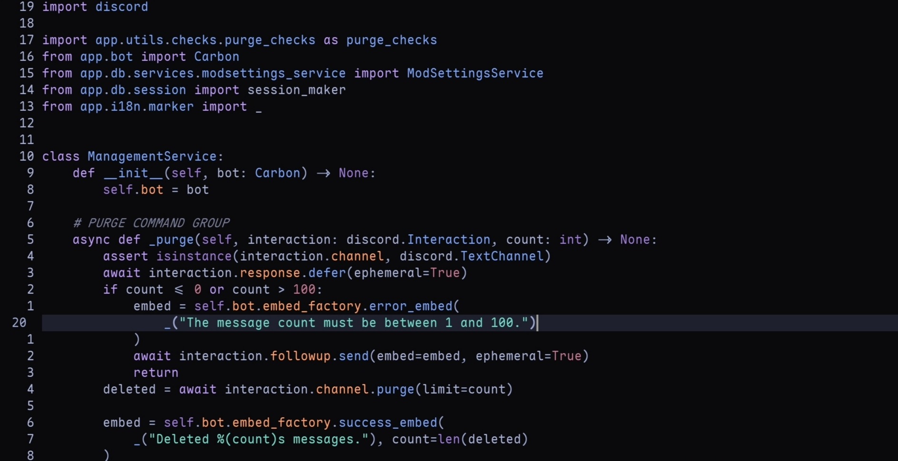

# midnight.nvim
A dark, muted colorscheme for Neovim.

<div align="center">
  
</div>

## Installation 
```lua
vim.pack.add({
  "https://github.com/sudoscrawl/midnight.nvim"
})

vim.cmd.colorscheme("midnight")
```
